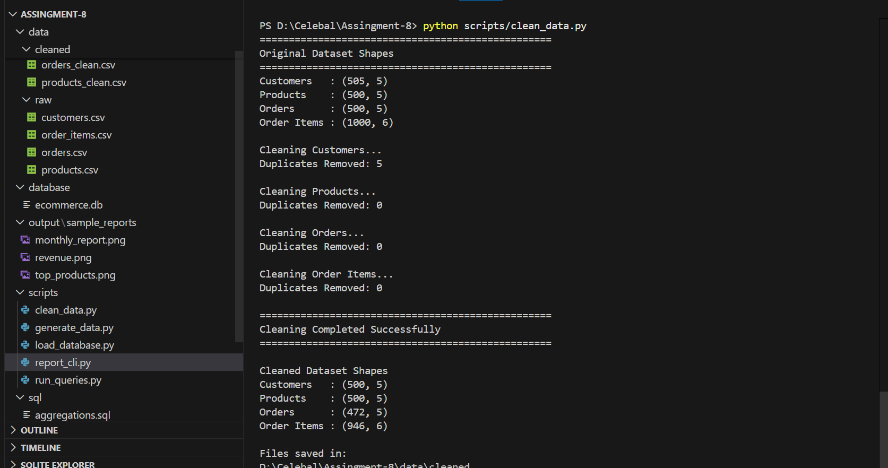
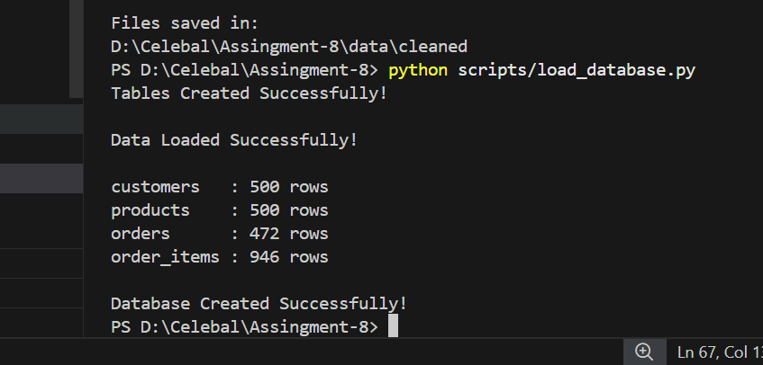
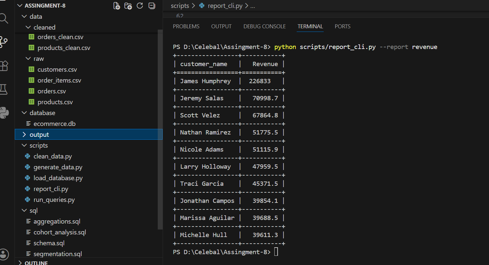
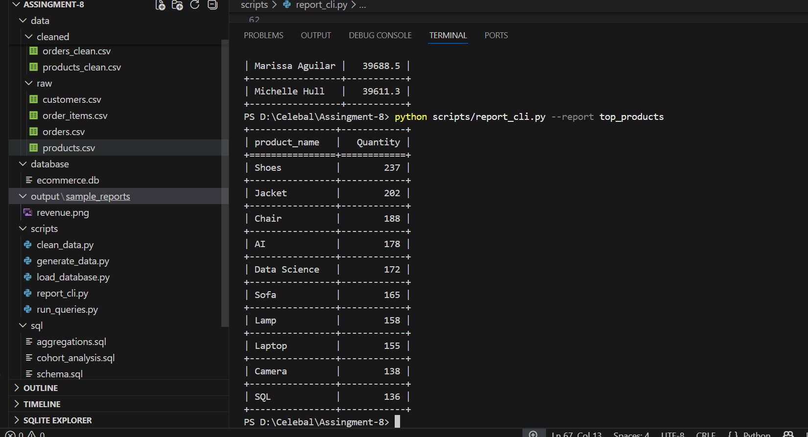

# E-Commerce Analytics System

## Project Overview

The E-Commerce Analytics System is an end-to-end data analytics project built using Python, Pandas, SQLite, and SQL. It demonstrates the complete workflow of generating business insights from e-commerce data, starting with raw datasets, performing data cleaning and validation, loading the cleaned data into a relational database, executing SQL analytics, and generating reports through a command-line interface (CLI).

This project simulates a real-world data engineering and analytics pipeline commonly used in e-commerce organizations.

---

## Objectives

- Clean and preprocess raw e-commerce datasets.
- Validate data quality and referential integrity.
- Load cleaned data into a relational database.
- Perform business analytics using SQL.
- Analyze customer behavior using window functions and cohort analysis.
- Segment customers based on purchasing patterns.
- Generate reports using a Python CLI application.

---

## Technologies Used

- Python
- Pandas
- SQLite
- SQL
- Faker
- NumPy
- Tabulate
- VS Code

---

## Project Structure

```text
ecommerce-analytics-system/
│
├── data/
│   ├── raw/
│   │   ├── customers.csv
│   │   ├── products.csv
│   │   ├── orders.csv
│   │   └── order_items.csv
│   │
│   └── cleaned/
│       ├── customers_clean.csv
│       ├── products_clean.csv
│       ├── orders_clean.csv
│       └── order_items_clean.csv
│
├── database/
│   └── ecommerce.db
│
├── scripts/
│   ├── clean_data.py
│   ├── load_database.py
│   ├── run_queries.py
│   └── report_cli.py
│
├── sql/
│   ├── schema.sql
│   ├── aggregations.sql
│   ├── window_functions.sql
│   ├── cohort_analysis.sql
│   └── segmentation.sql
│
├── output/
│   └── sample_reports/
│
├── requirements.txt
└── README.md
```

---

## Workflow

### Step 1 – Data Cleaning

- Load raw CSV datasets using Pandas.
- Remove duplicate records.
- Handle missing values.
- Convert data into appropriate formats.
- Validate relationships between tables.
- Export cleaned datasets.

---

### Step 2 – Database Creation

- Create SQLite database.
- Define tables with Primary Keys and Foreign Keys.
- Load cleaned datasets into database tables.
- Verify row counts after loading.

---

### Step 3 – SQL Analytics

Business reports generated include:

- Revenue by customer
- Revenue by product category
- Top-selling products
- Monthly revenue trends

---

### Step 4 – Window Functions

Implemented SQL window functions such as:

- RANK()
- DENSE_RANK()
- Running Total
- Moving Average

---

### Step 5 – Cohort Analysis

- Customer cohort identification
- Monthly retention analysis
- Customer activity tracking

---

### Step 6 – Customer Segmentation

Customers are categorized based on:

- Purchase Frequency
- Spending Level
- RFM-style metrics

---

### Step 7 – CLI Reporting Tool

Generate reports directly from the terminal.

Example:

```bash
python scripts/report_cli.py --report revenue
```

Available reports:

- revenue
- top_products
- monthly

---

## Installation

Clone the repository.

```bash
git clone <repository_url>
```

Move into the project directory.

```bash
cd ecommerce-analytics-system
```

Install dependencies.

```bash
pip install -r requirements.txt
```

---

## Execution Steps

### Clean the data

```bash
python scripts/clean_data.py
```

### Create the database

```bash
python scripts/load_database.py
```

### Execute SQL analytics

```bash
python scripts/run_queries.py
```

### Generate CLI reports

Revenue Report

```bash
python scripts/report_cli.py --report revenue
```

Top Products Report

```bash
python scripts/report_cli.py --report top_products
```

Monthly Report

```bash
python scripts/report_cli.py --report monthly
```

---

## Key Features

- End-to-end data processing pipeline
- Automated data cleaning
- Referential integrity validation
- SQLite database integration
- SQL joins and aggregations
- Window function analytics
- Cohort analysis
- Customer segmentation
- Command-line reporting tool

---

## Sample Output

Sample execution screenshots are available inside:









---

## Author

**Shivanshu Yadav**

Celebal Excellence Internship (Data Engineer) - Celebal Technologies